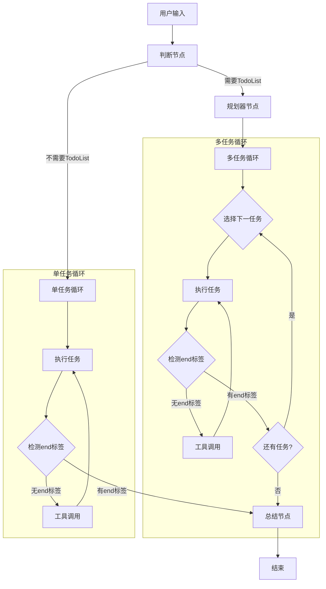

# Design Document: LangGraph Agent Refactor

## Overview

本设计文档描述了使用 LangGraph 重构智能体框架的技术方案。基于 `agent.md` 中定义的工作流程，系统将实现一个状态机驱动的智能体执行框架，支持：

设计要求：要长连接，用户输入问题后，把执行过程和llm回答内容流式输出给用户看

如果要使用pip 请加上uv ，例如uv pip list

1. **判断节点**: 分析用户问题，决定是否需要 TodoList
2. **规划器节点**: 生成结构化的 TodoList
3. **循环执行节点**: 支持多任务和单任务两种执行模式
4. **工具集成**: MCP 协议技能系统
5. **历史管理**: 基于 `<end></end>` 标签的历史记录管理

## Architecture



### 核心组件

1. **AgentState**: LangGraph 状态定义，包含所有执行上下文
2. **JudgeNode**: 判断节点，决定执行路径
3. **PlannerNode**: 规划器节点，生成 TodoList
4. **ExecutorNode**: 执行节点，处理任务执行和工具调用
5. **SummaryNode**: 总结节点，生成执行报告
6. **ToolExecutor**: 工具执行器，处理 MCP 和 Skills 调用
7. **PromptBuilder**: 提示词构建器，构建结构化提示词

## Components and Interfaces

### 1. AgentState (状态定义)

```python
class AgentState(TypedDict):
    """LangGraph Agent 状态定义"""
    # 会话信息
    session_id: str
    user_question: str
    
    # 执行控制
    needs_todolist: Optional[bool]  # 是否需要 TodoList
    current_mode: str  # "multi_task" | "single_task"
    
    # TodoList 相关
    todolist: List[TodoItem]  # 任务列表
    current_task_index: int  # 当前任务索引
    current_task: Optional[TodoItem]  # 当前任务
    
    # 执行状态
    iteration_count: int
    task_history: List[str]  # 当前任务的历史记录
    all_history: List[Dict]  # 所有历史记录
    
    # 工具和技能
    available_tools: List[ToolInfo]
    available_skills: List[SkillInfo]
    tool_results: List[ToolResult]
    
    # 结果
    task_completed: bool
    end_tag_detected: bool
    final_summary: Optional[str]
    errors: List[str]
    
    # 元数据
    created_at: str
    last_updated: str
```

### 2. TodoItem (任务项)

```python
@dataclass
class TodoItem:
    """TodoList 任务项"""
    id: str
    name: str
    description: str
    priority: str  # "high" | "medium" | "low"
    status: str  # "pending" | "in_progress" | "completed"
```

### 3. Node Interfaces

```python
# 判断节点
def judge_node(state: AgentState) -> AgentState:
    """判断是否需要 TodoList"""
    pass

# 规划器节点
def planner_node(state: AgentState) -> AgentState:
    """生成 TodoList"""
    pass

# 任务选择节点
def task_selector_node(state: AgentState) -> AgentState:
    """选择下一个待执行任务"""
    pass

# 执行节点
def executor_node(state: AgentState) -> AgentState:
    """执行当前任务"""
    pass

# 工具调用节点
def tool_call_node(state: AgentState) -> AgentState:
    """处理工具调用"""
    pass

# 总结节点
def summary_node(state: AgentState) -> AgentState:
    """生成执行总结"""
    pass
```

### 4. Routing Functions

```python
def route_after_judge(state: AgentState) -> str:
    """判断节点后的路由"""
    if state["needs_todolist"]:
        return "planner"
    return "single_task_executor"

def route_after_execution(state: AgentState) -> str:
    """执行节点后的路由"""
    if state["end_tag_detected"]:
        if state["current_mode"] == "multi_task":
            # 检查是否还有任务
            pending = [t for t in state["todolist"] if t.status == "pending"]
            if pending:
                return "task_selector"
        return "summary"
    return "tool_call"

def route_after_tool_call(state: AgentState) -> str:
    """工具调用后的路由"""
    if state["current_mode"] == "multi_task":
        return "multi_task_executor"
    return "single_task_executor"
```

### 5. PromptBuilder

```python
class PromptBuilder:
    """提示词构建器"""
    
    def build_execution_prompt(
        self,
        state: AgentState,
        expert_role: str,
        agent_instructions: str
    ) -> str:
        """
        构建执行提示词
        
        结构:
        1. 专家角色
        2. 智能体提示词
        3. 任务列表 (如果是多任务模式)
        4. 当前任务
        5. 可用工具和技能
        6. 结束标签说明
        7. 历史记录
        """
        pass
```

### 6. EndTagParser

```python
class EndTagParser:
    """结束标签解析器"""
    
    END_TAG_PATTERN = r'<end></end>'
    
    def detect_end_tag(self, response: str) -> bool:
        """检测是否包含结束标签"""
        pass
    
    def extract_content_before_end(self, response: str) -> str:
        """提取结束标签前的内容"""
        pass
    
    def parse_tool_calls(self, response: str) -> List[ToolCall]:
        """解析工具调用"""
        pass
```

### 7. ToolExecutor

```python
class ToolExecutor:
    """工具执行器"""
    
    def __init__(self, mcp_client: MCPClient, skill_manager: SkillManager):
        self.mcp_client = mcp_client
        self.skill_manager = skill_manager
    
    async def execute_tool(self, tool_call: ToolCall) -> ToolResult:
        """执行工具调用"""
        pass
    
    async def execute_skill(self, skill_name: str, params: Dict) -> SkillResult:
        """执行技能"""
        pass
```

## Data Models

### 1. Session Model

```python
class AgentSession:
    """会话模型"""
    session_id: str
    user_question: str
    session_name: str
    status: str  # "running" | "completed" | "failed"
    mode: str  # "multi_task" | "single_task"
    todolist_json: Optional[str]
    start_time: datetime
    end_time: Optional[datetime]
    total_iterations: int
    final_summary: Optional[str]
```

### 2. Execution Log Model

```python
class ExecutionLog:
    """执行日志模型"""
    log_id: str
    session_id: str
    node_name: str
    input_state_json: str
    output_state_json: str
    tool_calls_json: Optional[str]
    timestamp: datetime
```

### 3. Tool Call Model

```python
@dataclass
class ToolCall:
    """工具调用"""
    tool_name: str
    parameters: Dict[str, Any]
    source: str  # "mcp" | "skill"

@dataclass
class ToolResult:
    """工具结果"""
    tool_name: str
    success: bool
    result: Any
    error: Optional[str]
```

## Correctness Properties

*A property is a characteristic or behavior that should hold true across all valid executions of a system-essentially, a formal statement about what the system should do. 
Properties serve as the bridge between human-readable specifications and machine-verifiable correctness guarantees.*

### Property 1: Session Creation Uniqueness
*For any* two session creations, the generated session IDs SHALL be unique and non-empty.
**Validates: Requirements 1.1, 1.3**

### Property 2: Input Validation Consistency
*For any* string input, if the string is empty or contains only whitespace, the validation SHALL reject it; otherwise, it SHALL accept it.
**Validates: Requirements 1.2**

### Property 3: Judge Node Routing Correctness
*For any* judge decision result, if `needs_todolist` is true, the routing SHALL go to planner node; if false, it SHALL go to single-task executor.
**Validates: Requirements 2.2, 2.3**

### Property 4: TodoList Structure Validity
*For any* generated TodoList, each item SHALL contain non-empty id, name, description, and a valid priority value ("high", "medium", or "low").
**Validates: Requirements 3.1, 3.2**

### Property 5: Task Selection Order
*For any* TodoList with pending tasks, the task selector SHALL always select a task with status "pending" and update its status to "in_progress".
**Validates: Requirements 4.1**

### Property 6: End Tag Detection Accuracy
*For any* LLM response string, if it contains `<end></end>`, the parser SHALL detect it and return true; otherwise, it SHALL return false.
**Validates: Requirements 12.1, 12.3**

### Property 7: Content Extraction Before End Tag
*For any* LLM response containing `<end></end>`, the extracted content SHALL be exactly the substring before the first occurrence of `<end></end>`.
**Validates: Requirements 12.2, 12.4**

### Property 8: Task Completion State Transition
*For any* task execution where end tag is detected, the task status SHALL transition from "in_progress" to "completed".
**Validates: Requirements 4.3, 5.2**

### Property 9: Loop Termination Condition
*For any* multi-task execution, the loop SHALL terminate when all tasks have status "completed".
**Validates: Requirements 4.5**

### Property 10: History Accumulation
*For any* sequence of task iterations, the history SHALL contain all previous LLM responses in order.
**Validates: Requirements 8.1**

### Property 11: History Reset Between Tasks
*For any* task transition in multi-task mode, the task-specific history SHALL be cleared when starting a new task.
**Validates: Requirements 8.3**

### Property 12: Prompt Structure Completeness
*For any* constructed prompt, it SHALL contain: expert role, agent instructions, available tools/skills, end tag instructions, and history (if any).
**Validates: Requirements 13.1, 13.2, 13.3, 13.4, 13.5**

### Property 13: State Serialization Round Trip
*For any* valid AgentState, serializing to JSON and deserializing back SHALL produce an equivalent state.
**Validates: Requirements 14.1, 14.2**

### Property 14: Tool Call Parsing Correctness
*For any* LLM response containing tool call syntax, the parser SHALL extract the correct tool name and parameters.
**Validates: Requirements 6.1**

### Property 15: Error State Propagation
*For any* error during execution, the error SHALL be logged and the session status SHALL be updated to "failed".
**Validates: Requirements 9.4, 10.3**

## Error Handling

### 1. LLM 调用错误

```python
class LLMError(Exception):
    """LLM 调用错误"""
    pass

# 处理策略:
# - 重试机制 (最多3次)
# - 超时处理 (120秒)
# - 降级到默认响应
```

### 2. 工具调用错误

```python
class ToolExecutionError(Exception):
    """工具执行错误"""
    tool_name: str
    error_message: str

# 处理策略:
# - 记录错误到历史
# - 继续执行，让 LLM 决定下一步
# - 不中断整体流程
```

### 3. 状态序列化错误

```python
class StateSerializationError(Exception):
    """状态序列化错误"""
    pass

# 处理策略:
# - 转换复杂对象为字典
# - 跳过不可序列化字段
# - 记录警告日志
```

### 4. TodoList 解析错误

```python
class TodoListParseError(Exception):
    """TodoList 解析错误"""
    pass

# 处理策略:
# - 降级到单任务模式
# - 记录解析失败原因
# - 继续执行
```
